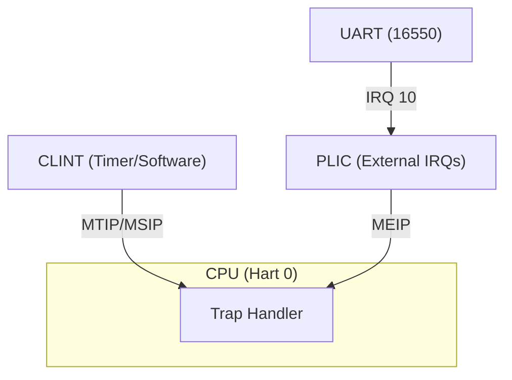

# Chronos: RISC-V Interrupt Playground

Chronos là một project nhỏ để học **interrupts trên RISC-V**.  
Hỗ trợ cả **CLINT (Core-Local Interruptor)** và **PLIC (Platform-Level Interrupt Controller)**.

## Cấu trúc thư mục

```
chronos/
├── Makefile
├── linker.ld
├── src/
│   ├── asm/
│   │   ├── _start.S
│   │   └── trap.S
│   ├── kernel.c
│   ├── clint.c
│   ├── plic.c
│   ├── uart.c
│   └── include/
│       ├── defs.h
│       ├── clint.h
│       ├── plic.h
│       └── uart.h
└── docs/
    ├── README.md
    └── arch-diagram.md
```

## Build & Run

```bash
make
make run
```

Sẽ thấy output:

```
Chronos kernel booting...
Timer armed; entering WFI loop.
[CLINT] timer tick
[CLINT] timer tick
...
```

## Diagram


