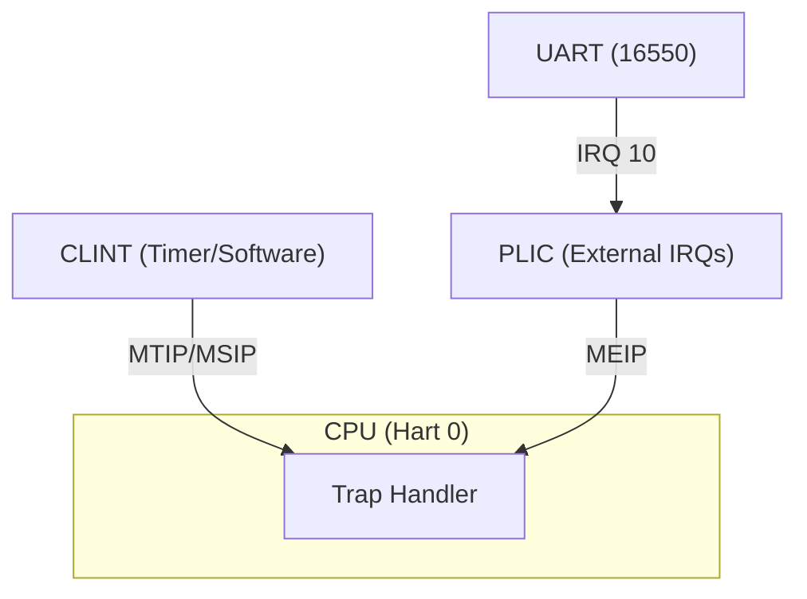

# Chronos: RISC-V Interrupt & Scheduler Playground

Chronos là một project nhỏ để học **interrupts và multitasking trên RISC-V**.
Hỗ trợ:
- **CLINT (Core-Local Interruptor)** - Timer interrupts
- **PLIC (Platform-Level Interrupt Controller)** - External interrupts
- **Preemptive Scheduler** - Context switching và round-robin scheduling

## Cấu trúc thư mục

```
chronos/
├── Makefile
├── linker.ld
├── src/
│   ├── asm/
│   │   ├── _start.S
│   │   └── trap.S
│   ├── kernel.c
│   ├── modules/
│   │   ├── clint/
│   │   │   ├── clint.c
│   │   │   └── clint.h
│   │   ├── plic/
│   │   │   ├── plic.c
│   │   │   └── plic.h
│   │   ├── uart/
│   │   │   ├── uart.c
│   │   │   └── uart.h
│   │   └── sched/
│   │       ├── sched.c
│   │       ├── sched.h
│   │       ├── context.h
│   │       └── switch.S
│   └── include/
│       └── defs.h
└── docs/
    ├── README.md
    ├── clint_vs_plic.md
    └── scheduler.md
```

## Features

### Modular Architecture
- Clean separation of kernel subsystems
- Each module is self-contained with its own header
- Easy to add new modules

### Scheduler Module
- **Context switching** using RISC-V callee-saved registers
- **Cooperative scheduling** - tasks can yield voluntarily
- **Preemptive scheduling** - timer-driven task switches
- Round-robin between 2 tasks (easily extensible)
- See [docs/scheduler.md](docs/scheduler.md) for details

### Interrupt Support
- **CLINT** for timer interrupts (M-mode)
- **PLIC** for external interrupts (UART, etc.)
- Trap handler with interrupt/exception routing

## Build & Run

```bash
make
make run
```

Expected output:

```
[CLINT] timer tick, task=0
[CLINT] timer tick, task=1
[CLINT] timer tick, task=0
[CLINT] timer tick, task=1
...
```

The task ID alternates showing preemptive multitasking is working!

## Diagram


