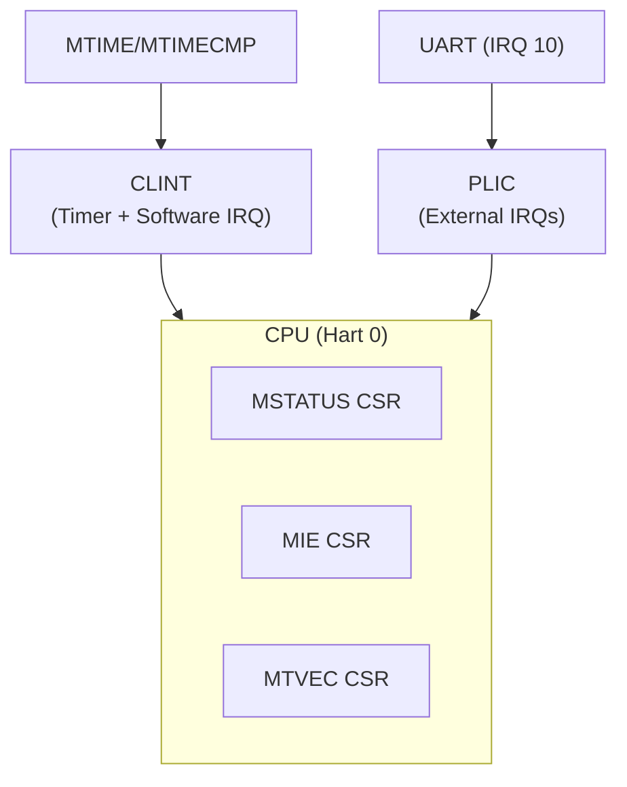

# 📝 Tài liệu: CLINT vs PLIC trong RISC-V

## 1. Giới thiệu
Trong hệ thống RISC-V, **ngắt (interrupt)** được chia thành hai nhóm lớn:  
- **Core-local interrupts**: chỉ ảnh hưởng đến từng CPU core (hart).  
- **External interrupts**: đến từ thiết bị ngoại vi (UART, disk, network, v.v.).  

Hai thành phần quản lý tương ứng là:  
- **CLINT (Core Local Interruptor)**  
- **PLIC (Platform-Level Interrupt Controller)**  

---

## 2. CLINT
### 2.1 Chức năng
- Quản lý ngắt **timer** và **software** cho từng hart.  
- Thường dùng để lập lịch (scheduler), tạo “tick” ngắt định kỳ.  

### 2.2 Thanh ghi chính
- `mtime` (64-bit, global): bộ đếm thời gian toàn hệ thống.  
- `mtimecmp[h]` (64-bit, per-hart): khi `mtime >= mtimecmp[h]` → sinh ngắt timer cho hart đó.  

### 2.3 Địa chỉ (trên QEMU `virt`)
- `0x0200_0000` → `mtime`  
- `0x0200_4000` → `mtimecmp[0]` (hart 0)  

---

## 3. PLIC
### 3.1 Chức năng
- Gom các ngắt **ngoại vi** từ thiết bị.  
- Xác định mức ưu tiên, phân phối ngắt đến CPU.  

### 3.2 Địa chỉ (QEMU `virt`)
- Base: `0x0c00_0000`  
- Claim/complete register: để CPU đọc IRQ ID và báo đã xử lý.  

### 3.3 Ví dụ thiết bị trong QEMU
- **UART (ns16550a)** → IRQ 10  
- VirtIO block/net → IRQ 1x–2x  

---

## 4. So sánh CLINT vs PLIC

| Đặc điểm        | **CLINT** | **PLIC** |
|-----------------|-----------|----------|
| Loại ngắt       | Timer, Software (per-hart) | External (thiết bị ngoại vi) |
| Địa chỉ QEMU    | `0x0200_0000`              | `0x0c00_0000` |
| Mục đích        | Tick hệ thống, scheduling  | Driver cho I/O device |
| Bắt buộc?       | Có (dùng cho timer)        | Không (chỉ khi cần device) |

---

## 5. Tại sao ban đầu dùng CLINT thay vì PLIC?
- **Timer interrupt** là ngắt “local” → đi trực tiếp từ CLINT vào CPU.  
- Nếu chỉ bật PLIC mà không gắn thêm device → sẽ không có interrupt nào đến → hệ thống “treo” ở chỗ chờ ngắt.  

👉 Vì thế: dùng CLINT để test timer là bước khởi đầu đúng đắn.  

---

## 6. Mở rộng sang PLIC
- Hoàn toàn **có thể** mở rộng sang PLIC khi muốn làm việc với thiết bị ngoại vi.  
- Ví dụ phổ biến:  
  - **UART (IRQ 10)** → nhận input từ console qua interrupt (không polling).  
  - **VirtIO block/net** → nhận ngắt khi I/O hoàn thành.  

### Hướng đi tiếp
1. Giữ CLINT để cung cấp timer tick (cho scheduler).  
2. Bật PLIC và viết driver cho UART:  
   - Map IRQ 10.  
   - Enable trong PLIC.  
   - Viết hàm xử lý khi có ký tự mới đến từ UART.  

---

## 7. Sơ đồ tổng quan

